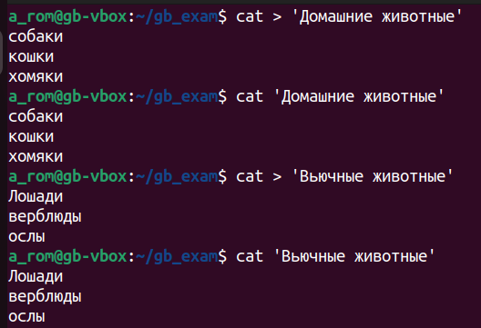
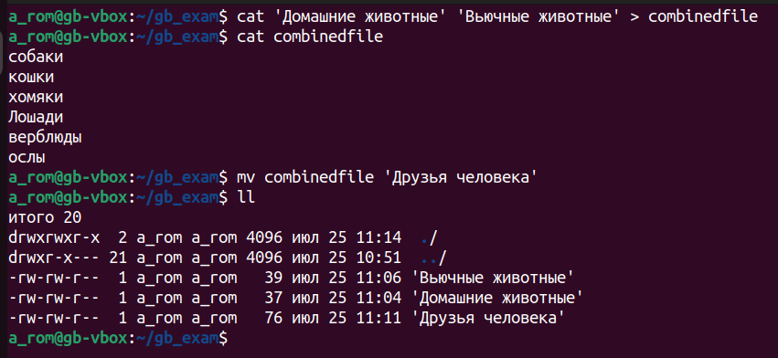
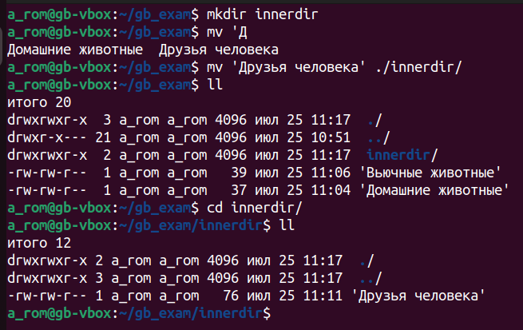
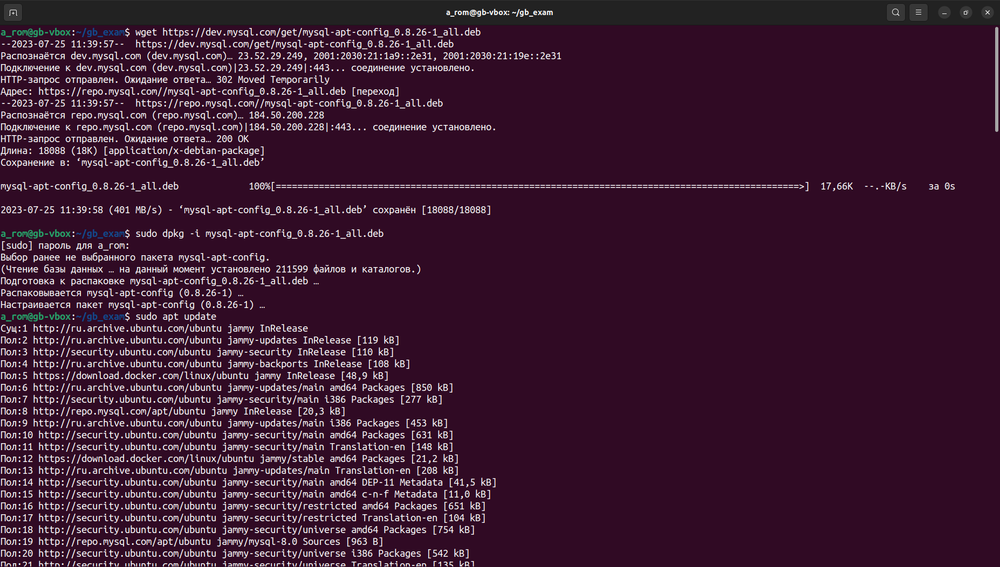
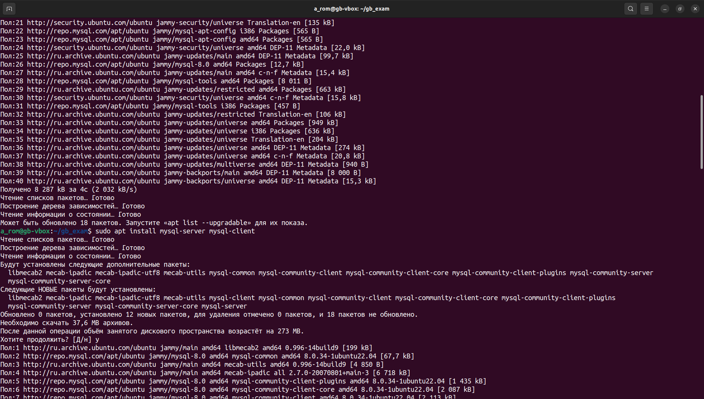
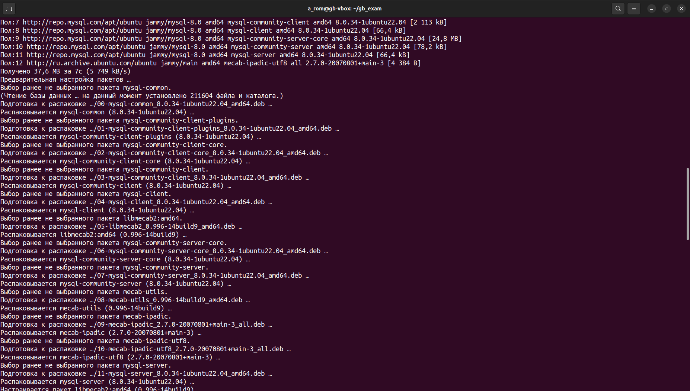
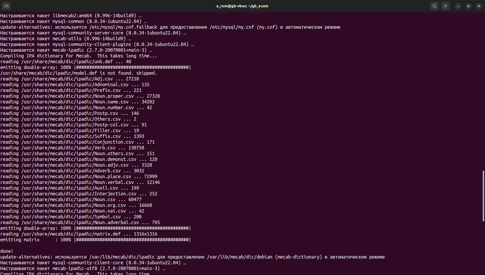
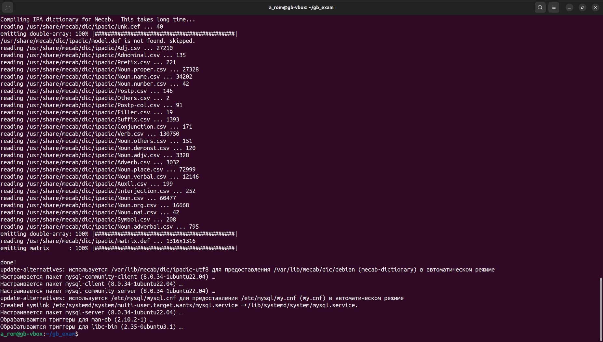
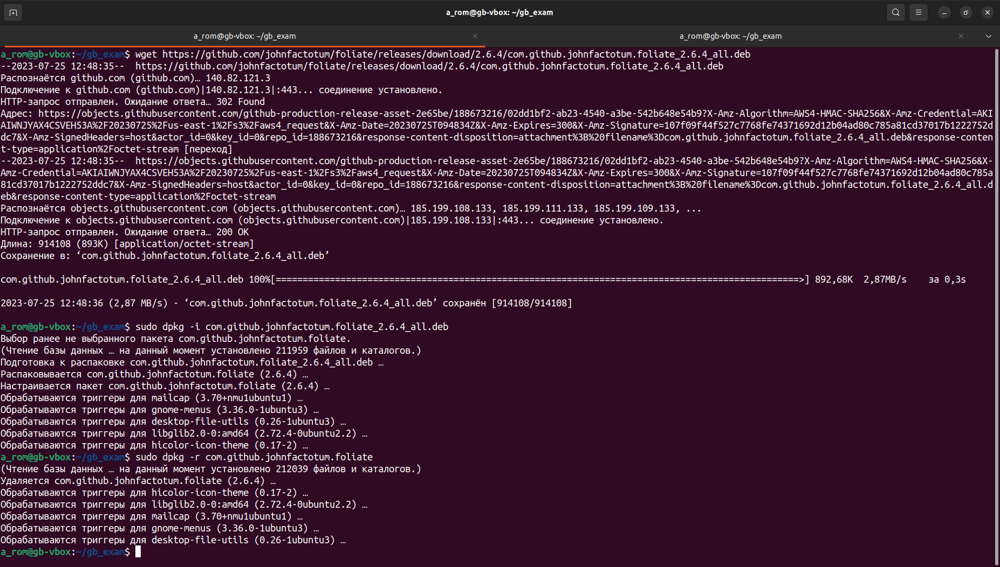
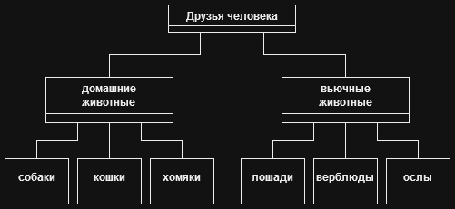

# Итоговая контрольная работа

## Задания

<br>

1. Используя команду cat в терминале операционной системы Linux, создать
два файла Домашние животные (заполнив файл собаками, кошками,
хомяками) и Вьючные животными заполнив файл Лошадьми, верблюдами и
ослы), а затем объединить их. Просмотреть содержимое созданного файла.
Переименовать файл, дав ему новое имя (Друзья человека).

- *Создание файлов*


- *Объединение созданных файлов в новый файл и его переименование*


<br>

2. Создать директорию, переместить файл туда.

- *Перемещение созданного файла в новую директорию*


<br>

3. Подключить дополнительный репозиторий MySQL. Установить любой пакет
из этого репозитория.

- *Подключение и установка пакета из репозитория MySQL*






<br>

4. Установить и удалить deb-пакет с помощью dpkg.

- *Работа с deb-пакетом*


<br>

5. Выложить историю команд в терминале ubuntu

- *С помощью команды __history > history.txt__ сохранена история терминала в файл [history.txt](./linux/history.txt)*

<br>

6. Нарисовать диаграмму, в которой есть класс родительский класс, домашние
животные и вьючные животные, в составы которых в случае домашних
животных войдут классы: собаки, кошки, хомяки, а в класс вьючные животные
войдут: Лошади, верблюды и ослы).


<br>

7. В подключенном MySQL репозитории создать базу данных “Друзья
человека”
``` SQL
DROP DATABASE IF EXISTS animals;
CREATE DATABASE animals;
```

<br>

8. Создать таблицы с иерархией из диаграммы в БД
``` SQL
USE animals;

CREATE TABLE human_friends (
  id INT NOT NULL AUTO_INCREMENT,
  type_name VARCHAR(45) NOT NULL UNIQUE,
  PRIMARY KEY (id)
);

INSERT INTO human_friends (type_name)
VALUES ("pets"), ("pack_animals");

CREATE TABLE pets (
  id INT NOT NULL AUTO_INCREMENT,
  id_type INT NOT NULL,
  group_name VARCHAR(100) NOT NULL UNIQUE,
  PRIMARY KEY (id),
  FOREIGN KEY (id_type) REFERENCES human_friends (id) ON DELETE CASCADE ON UPDATE CASCADE
);

INSERT INTO pets (id_type, group_name)
VALUES 
  (1, "dogs"), 
  (1, "cats"), 
  (1, "hamsters");

CREATE TABLE pack_animals (
  id INT NOT NULL AUTO_INCREMENT,
  id_type INT NOT NULL,
  group_name VARCHAR(100) NOT NULL UNIQUE,
  PRIMARY KEY (id),
  FOREIGN KEY (id_type) REFERENCES human_friends (id) ON DELETE CASCADE
);

INSERT INTO pack_animals (id_type, group_name)
VALUES
  (2, "horses"), 
  (2, "camels"), 
  (2, "donkeys");

CREATE TABLE dogs (
  id INT NOT NULL AUTO_INCREMENT,
  id_group INT NOT NULL,
  PRIMARY KEY (id),
  FOREIGN KEY (id_group) REFERENCES pets (id) ON DELETE CASCADE ON UPDATE CASCADE
);

CREATE TABLE cats (
  id INT NOT NULL AUTO_INCREMENT,
  id_group INT NOT NULL,
  PRIMARY KEY (id),
  FOREIGN KEY (id_group) REFERENCES pets (id) ON DELETE CASCADE ON UPDATE CASCADE
); 

CREATE TABLE hamsters (
  id INT NOT NULL AUTO_INCREMENT,
  id_group INT NOT NULL,
  PRIMARY KEY (id),
  FOREIGN KEY (id_group) REFERENCES pets (id) ON DELETE CASCADE ON UPDATE CASCADE
);

CREATE TABLE horses (
  id INT NOT NULL AUTO_INCREMENT,
  id_group INT NOT NULL,
  PRIMARY KEY (id),
  FOREIGN KEY (id_group) REFERENCES pack_animals (id) ON DELETE CASCADE ON UPDATE CASCADE
);

CREATE TABLE camels (
  id INT NOT NULL AUTO_INCREMENT,
  id_group INT NOT NULL,
  PRIMARY KEY (id),
  FOREIGN KEY (id_group) REFERENCES pack_animals (id) ON DELETE CASCADE ON UPDATE CASCADE
);

CREATE TABLE donkeys (
  id INT NOT NULL AUTO_INCREMENT,
  id_group INT NOT NULL,
  PRIMARY KEY (id),
  FOREIGN KEY (id_group) REFERENCES pack_animals (id) ON DELETE CASCADE ON UPDATE CASCADE
);
```

<br>

9. Заполнить низкоуровневые таблицы именами(животных), командами
которые они выполняют и датами рождения

- *Добавление новых столбцов в таблицы*
``` SQL
ALTER TABLE dogs
ADD animal_name VARCHAR(100) NOT NULL,
ADD birthday DATE, 
ADD command VARCHAR(100);

ALTER TABLE cats
ADD animal_name VARCHAR(100) NOT NULL,
ADD birthday DATE, 
ADD command VARCHAR(100);

ALTER TABLE hamsters
ADD animal_name VARCHAR(100) NOT NULL,
ADD birthday DATE, 
ADD command VARCHAR(100);

ALTER TABLE horses
ADD animal_name VARCHAR(100) NOT NULL,
ADD birthday DATE, 
ADD command VARCHAR(100);

ALTER TABLE camels
ADD animal_name VARCHAR(100) NOT NULL,
ADD birthday DATE, 
ADD command VARCHAR(100);

ALTER TABLE donkeys
ADD animal_name VARCHAR(100) NOT NULL,
ADD birthday DATE, 
ADD command VARCHAR(100);
```

- *Заполнение только низкоуровневых таблиц именами(животных), командами
которые они выполняют и датами рождения*
``` SQL
INSERT INTO dogs(animal_name, birthday, command, id_group)
VALUES 
  ("Chester", "2020-01-01", "run", 1),
  ("Bob", "2020-06-01", "jump", 1),
  ("Milo", "2021-01-01", "eat", 1);

INSERT INTO cats(animal_name, birthday, command, id_group)
VALUES 
  ("Cooper", "2019-01-01", "run", 2),
  ("Charlie", "2018-06-01", "play", 2),
  ("Max", "2022-01-01", "sleep", 2);

INSERT INTO hamsters(animal_name, birthday, command, id_group)
VALUES 
  ("Bear", "2023-01-01", "eat", 3),
  ("MrBig", "2022-06-01", "eat", 3),
  ("Tucker", "2022-01-01", "run", 3);

INSERT INTO horses(animal_name, birthday, command, id_group)
VALUES 
  ("April", "2018-01-01", "jump", 1),
  ("Apple", "2019-06-01", "run", 1);

INSERT INTO camels(animal_name, birthday, command, id_group)
VALUES 
  ("Elliot", "2018-01-01", "go", 2),
  ("Iron", "2022-06-01", "stay", 2);

INSERT INTO donkeys(animal_name, birthday, command, id_group)
VALUES 
  ("Henry ", "2010-01-01", "do nothing", 3),
  ("Oscar", "2022-12-01", "go", 3);
```

<br>

10. Удалив из таблицы верблюдов, т.к. верблюдов решили перевезти в другой
питомник на зимовку. Объединить таблицы лошади, и ослы в одну таблицу
- *Удаление верблюдов*
``` SQL
DELETE FROM pack_animals
WHERE group_name = "camels";
```

- *Создание новой таблицы и ее заполнение в соответствии с условием задачи.
Каждой записи присвоивается новый id 
(из-за [особенностей](https://dev.mysql.com/doc/refman/8.0/en/innodb-auto-increment-handling.html)
MySQL автоинкрементирование может быть с пропусками)*
``` SQL
CREATE TABLE pack_animals_no_camels (
  id INT AUTO_INCREMENT,
  id_group INT NOT NULL,
  animal_name VARCHAR(100) NOT NULL,
  birthday DATE, 
  command VARCHAR(100),
  PRIMARY KEY (id),
  FOREIGN KEY (id_group) REFERENCES pack_animals (id) ON DELETE CASCADE ON UPDATE CASCADE
);

INSERT INTO pack_animals_no_camels (id_group, animal_name, birthday, command)
SELECT id_group, animal_name, birthday, command FROM horses;

INSERT INTO pack_animals_no_camels (id_group, animal_name, birthday, command)
SELECT id_group, animal_name, birthday, command FROM donkeys;
```

<br>

11. Создать новую таблицу “молодые животные” в которую попадут все
животные старше 1 года, но младше 3 лет и в отдельном столбце с точностью
до месяца подсчитать возраст животных в новой таблице

- *Поскольку по условиям задания общая таблица со всеми животными отсутствует, для удобства создаем временную таблицу, в которую включаем данные всех животных (при этом учитываем, что верблюдов нет)*
``` SQL
CREATE TEMPORARY TABLE animals
AS 
SELECT * FROM pack_animals_no_camels 
UNION SELECT * FROM cats
UNION SELECT * FROM hamsters
UNION SELECT * FROM dogs;
```

- *На основе сформированной временной таблицы создаем новую требуемую таблицу с дополнительным столбцом, согласно выборке по возрасту*
``` SQL
CREATE TABLE young_animals
AS
SELECT *, TIMESTAMPDIFF(MONTH, birthday, current_date()) AS age_months 
FROM animals
WHERE TIMESTAMPDIFF(YEAR, birthday, current_date()) BETWEEN 1 AND 3; 
```

12. Объединить все таблицы в одну, при этом сохраняя поля, указывающие на
прошлую принадлежность к старым таблицам.
- *Для создания новой таблицы используем ранее сформированную временную таблицу*
``` SQL
CREATE TABLE all_animals
AS
SELECT * FROM animals;
```

<br>

 > *__[Скрипт](./db/script.sql) sql прилагается__*

<br>

13. Создать класс с Инкапсуляцией методов и наследованием по диаграмме.

14. Написать программу, имитирующую работу реестра домашних животных.
В программе должен быть реализован следующий функционал:

    14.1. Завести новое животное

    14.2. определять животное в правильный класс

    14.3. увидеть список команд, которое выполняет животное

    14.4. обучить животное новым командам

    14.5. Реализовать навигацию по меню

15. Создайте класс Счетчик, у которого есть метод add(), увеличивающий̆
значение внутренней̆ int переменной̆ на 1 при нажатие “Завести новое
животное” ~~Сделайте так, чтобы с объектом такого типа можно было работать в
блоке try-with-resources. Нужно бросить исключение, если работа с объектом
типа счетчик была не в ресурсном try и/или ресурс остался открыт. Значение
считать в ресурсе try, если при заведения животного заполнены все поля.~~ <sup>1</sup>

*<sup>1</sup> В программе отсутствует необходимость во внешних ресурсах, 
поэтому блок try-with-resourses не использовался.*